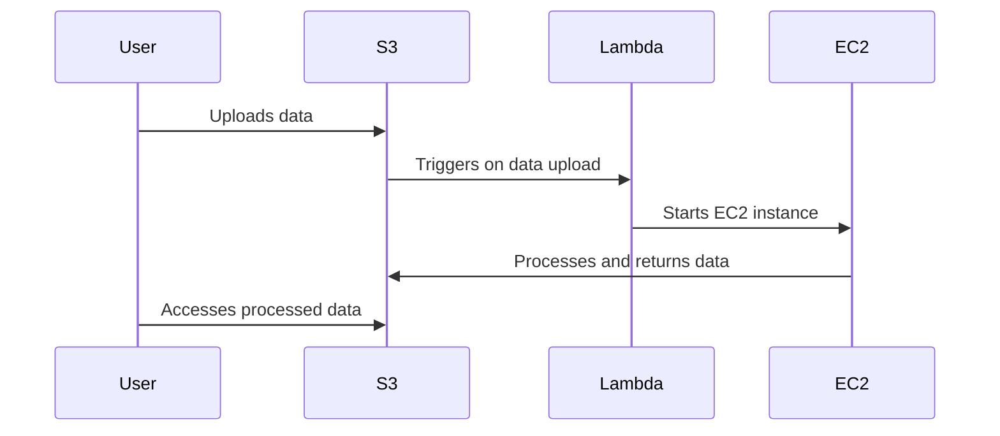

# Feel-and-Think

```mermaid
sequenceDiagram
    participant User
    participant S3
    participant Lambda
    participant EC2

    User->>S3: Uploads data
    S3->>Lambda: Triggers on data upload
    Lambda->>EC2: Starts EC2 instance
    EC2->>S3: Processes and returns data
    User->>S3: Accesses processed data
```
